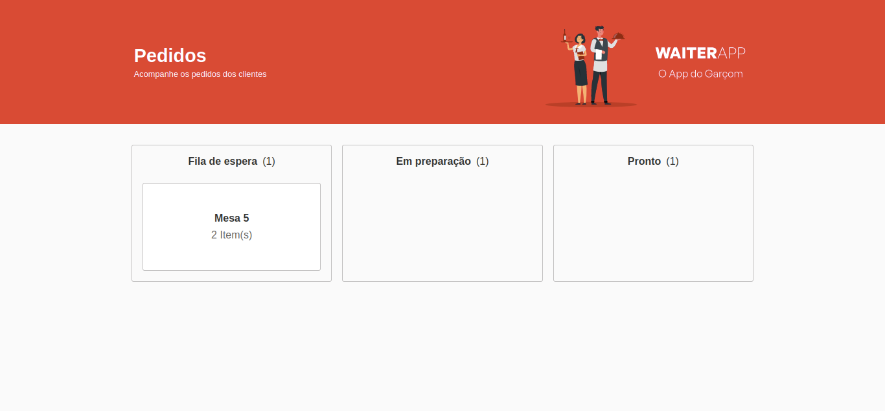
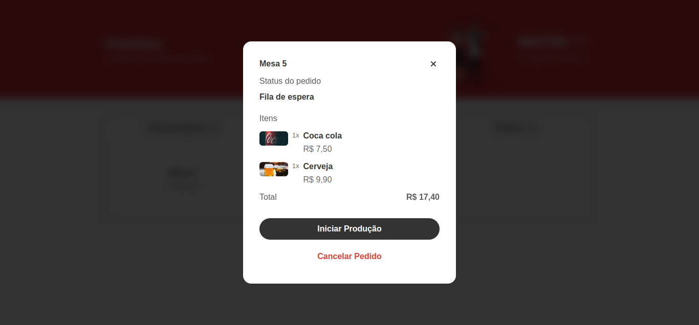

# WAITER-APP;

## Começando.

Bem-vindo ao Waiter App! Este projeto destina-se a ser utilizado na cozinha, onde todos os pedidos por mesa são registrados por meio do aplicativo mobile utilizado pelo garçom. Além disso, o painel de controle é atualizado em tempo real, sem a necessidade de atualizar a página manualmente, graças à implementação do WebSocket. O painel de controle é responsivo e pode ser utilizado em dispositivos de todos os tamanhos.

## Funcionalidades Principais.

- Visualização de Pedidos: Nesta seção, é possível visualizar os detalhes de cada pedido, incluindo a quantidade de pedidos, o status, a mesa associada e a opção de cancelamento.
- Atualização em Tempo Real: Graças à implementação do WebSocket, o painel de controle é atualizado instantaneamente assim que um pedido é confirmado, sem a necessidade de atualizar a página.

## 📋 Pré-requisitos

Para você rodar o projeto em sua maquina local você necessita ter essas tecnologias já instaladas ou você pode instalar:

- NodeJs: você pode instalar ([clicando aqui](https://nodejs.org/en/download/)).

- Banco de dados MongoDB: você pode instalar ([clicando aqui](https://www.mongodb.com/docs/manual/installation/)).

- Yarn: você pode instalar o yarn ([clicando aqui](https://classic.yarnpkg.com/lang/en/docs/install/#debian-stable)).

## Executando o projeto em seu ambiente de desenvolvimento

Siga as etapas abaixo para executar o projeto em seu ambiente de desenvolvimento:

# 1. Instale as dependências

Entre no diretório "server", execute o seguinte comando para instalar as dependências necessárias:

```
yarn install
```

# 2. Inicialize o projeto

Para inicializar o projeto, utilize o seguinte comando:

```
yarn dev
```

# 3. Instale as dependências

Entre no diretório "frontend", execute o seguinte comando para instalar as dependências necessárias:

```
yarn install
```

# 4. Inicialize o projeto

Para inicializar o projeto, utilize o seguinte comando:

```
yarn dev
```

Agora você pode desfrutar do Waiter App em seu ambiente de desenvolvimento e realizar testes e modificações de forma fácil e prática.

## Demostração do APP:

<p>- DASHBOARD:<p>


<br><br>

<p>- MODAL COM DETALHES DO PEDIDO:<p>


<br><br>

## ✒️ Autor

- [Mateus](https://github.com/mateusfelixdias).
